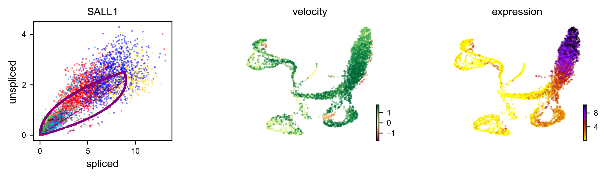

# Date
2022-02-022

# Rough workflow
1. Re-quantify with kallisto (as I need the unspliced (intronic) quant)
2. Take the h5ad objects and re-create with your UMAP view
3. Run [scVelo](https://scvelo.readthedocs.io) velocity analysis
4. Make plots and briefly discuss results

# R load
```{r}
suppressPackageStartupMessages({
    library("tidyverse")
    library("reticulate")
    library("ggplot2")
    library("SingleCellExperiment")
    library("scater")
    library("Seurat")
    library("SeuratDisk")
    library("zellkonverter")
})
# load('~/data/chick_miruna/08052021.RData')
# save just combined to reduce load time from Miruna's entire environment
# save(combined, file = '~/data/chick_miruna/combined_mgg_08052021.Rdata' )
load('~/data/chick_miruna/combined_mgg_08052021.Rdata')
combined

color_palette <- pals::glasbey()[1:14]
names(color_palette) <- seq(0,13, 1)
```

# Python load
```{python}
import scvelo as scv
import scanpy as sc
import cellrank as cr
```

# Run scVelo
```{r}
rmarkdown::render("velocitity_prep.Rmd", "html_document")
```

# Recolored your UMAPs
```{r, fig.width=10, fig.height=3}
DimPlot(combined, label = TRUE, label.box = TRUE, split.by = 'cluster.condition', pt.size = 1) + scale_color_manual(values = color_palette) + scale_fill_manual(values = alpha(rep('white', 14), 0.9))

DimPlot(combined, split.by = 'cluster.condition',group.by = 'Phase' ) + scale_color_manual(values = pals::brewer.set2(5) %>% unname())
```


# Overall Velocity
WT, G15, then G16

Velocity is the relationship between unspliced (the "future") and spliced (the "present") mRNA. If there is a higher ratio of unspliced to spliced of a transcript, then presumably in the future the cell will be splicing and using more of the that transcript. Vice versa for higher ratios of spliced / unspliced. By linking nearby cells (graph) and the velocities you can also infer direction. 


```{r}


```

# Diff Velocity
You can take each cluster and identify genes whose velocity differs between them

```{r}
velo_table_WT <- read_csv("WT.rank_velocity.csv") %>% pivot_longer(-`...1`) %>% dplyr::rename(Cluster = name, Gene = value) %>% select(-...1) %>% mutate(Sample = 'WT')
velo_table_G15 <- read_csv("G15.rank_velocity.csv") %>% pivot_longer(-`...1`) %>% dplyr::rename(Cluster = name, Gene = value) %>% select(-...1) %>% mutate(Sample = 'G15')
velo_table_G16 <- read_csv("G16.rank_velocity.csv") %>% pivot_longer(-`...1`) %>% dplyr::rename(Cluster = name, Gene = value) %>% select(-...1) %>% mutate(Sample = 'G16')
velo <- bind_rows(velo_table_WT, velo_table_G15, velo_table_G16) %>% unique()
velo %>% mutate(Cluster = as.integer(Cluster)) %>% group_by(Cluster, Gene) %>% summarise(`Number of Samples with Diff Velocity` = n(), `Samples with Diff Velocity` = paste(Sample, collapse = ', ')) %>% DT::datatable(filter = 'top', options = list(
  pageLength = 20, autoWidth = TRUE)) 
```

## Let's look at DPYSL3, which is listed for cluster 2, G15 and G16 (and not WT)
```{python}
gene = 'DPYSL3'
for prefix in ['WT', 'G15','G16']:
  print(prefix)
  if prefix == 'WT':
    file = '/Users/mcgaugheyd/data/chick_miruna/m006_scVelo.h5ad'
  if prefix == 'G15':
    file = '/Users/mcgaugheyd/data/chick_miruna/m007_scVelo.h5ad'
  if prefix == 'G16':
    file = '/Users/mcgaugheyd/data/chick_miruna/m008_scVelo.h5ad'
  adata = sc.read_h5ad(file)
  scv.pl.velocity(adata, [gene], show = False, save = prefix +  '.' + gene + '.png', dpi = 300, color ='seurat_clusters',  palette=color_palette, )

```
### Again UMAP for your reference
```{r}
DimPlot(combined, label = TRUE, label.box = TRUE, split.by = 'cluster.condition', pt.size = 1) + scale_color_manual(values = color_palette) + scale_fill_manual(values = alpha(rep('white', 14), 0.9))
```
DPLYSL3 velocity drops in cluster 2 in the WT, but is maintained in the G15/G16. We also see reduced velocity in the G15/G16 in the top right branch, while the WT maintains the velocity. 

[DPYSL3 has a role in migration and cell cycle](https://www.pnas.org/content/115/51/E11978)


# SALL1
WT, G15, then G16

No *huge* differences in velocity characteristics. Quick viz explainer for velocity: 


We we see a *negative* velocity of SALL1 in cluster 7 in the WT which is not present in the mutants.

Overall SALL1 velocity (and expression) appears lower in the G15/G16 relative to the WT.


```{r}



```

# WT, then G15, then G16 PAGA Cluster Trajectory Graph
Relationships between clusters (PAGA algorithm attempts to infer differentiation path)

This will be more informative when the cluster names are swapped out for stuff like "progenitors" and "cones"

This also may be total trash - I can't remember what cluster is doing what...so perhaps these relationships make no sense?
```{r}


```


<!-- # CellRank (not useful?) -->


<!-- ```{python} -->
<!-- adata = sc.read_h5ad('/Users/mcgaugheyd/data/chick_miruna/m007_scVelo.h5ad') -->
<!-- cr.tl.terminal_states(adata, cluster_key="seurat_clusters", weight_connectivities=0.4, n_jobs = 1, backend='threading') -->
<!-- #cr.pl.terminal_states(adata) -->

<!-- cr.tl.initial_states(adata, cluster_key="seurat_clusters", n_jobs = 1, backend='threading') -->
<!-- #cr.pl.initial_states(adata, discrete=True) -->

<!-- cr.tl.lineages(adata) -->
<!-- #cr.pl.lineages(adata, same_plot=False) -->


<!-- scv.tl.recover_latent_time(adata, root_key="initial_states_probs", end_key="terminal_states_probs") -->
<!-- scv.tl.paga( -->
<!--     adata, -->
<!--     groups="seurat_clusters", -->
<!--     root_key="initial_states_probs", -->
<!--     end_key="terminal_states_probs", -->
<!--     use_time_prior="velocity_pseudotime", -->
<!-- ) -->


<!-- cr.pl.cluster_fates( -->
<!--     adata, -->
<!--     mode="paga_pie", -->
<!--     cluster_key="seurat_clusters", -->
<!--     basis="umap", -->
<!--     node_size_scale=5, -->
<!--     edge_width_scale=1, -->
<!--     max_edge_width=4, palette=color_palette, dpi = 300, -->
<!--     title="directed PAGA", show = False, save  = 'pie.test.png' -->
<!-- ) -->
<!-- ``` -->
